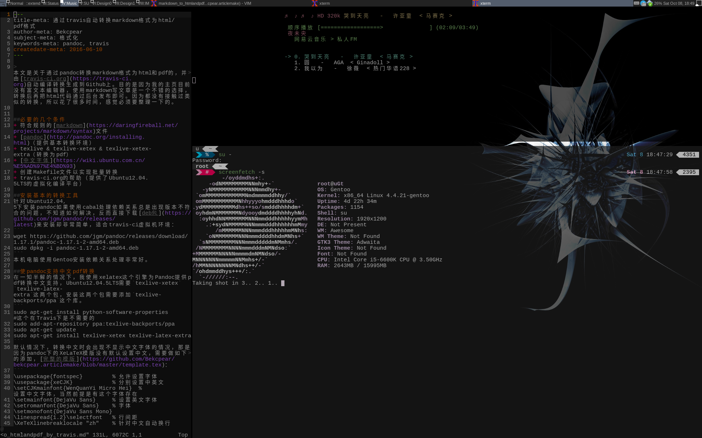

###My configuration files for Gentoo Linux.

+ Widows Manager is Awesome.
+ no initramfs file
+ vim is configred for python now.
+ ...

关于配色的简单介绍看[这里](INTRO/aboutColor.md)
关于更新看[这里](INTRO/updateinfo.md)
