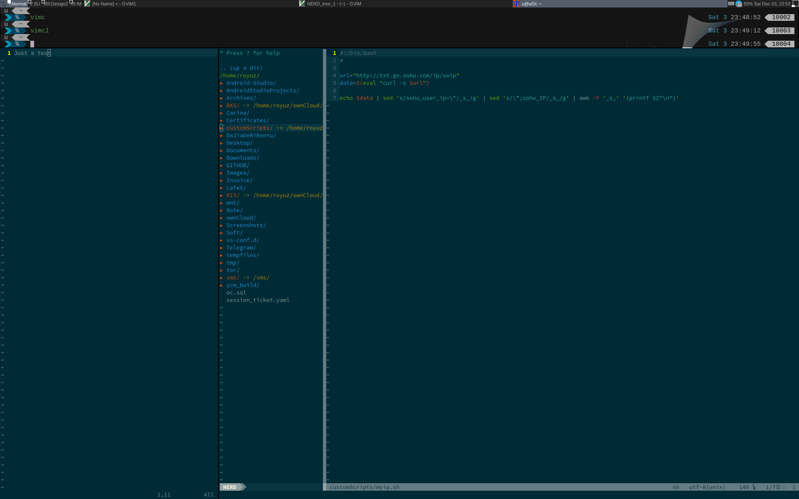

###一个备忘

调整了一个Awesome几个窗口平铺尺寸，效果如图：



当前达成条件：

1. `.Xresources` 字体配置如下：

  ```
  xterm*font: -*-fixed-medium-r-*-*-18-*-*-*-*-*-iso8859-*
  xterm*boldFont: -*-fixed-medium-r-*-*-18-*-*-*-*-*-iso8859-*
  xterm*font1: -*-*-*-*-*-*-2-*-*-*-*-*-*-*
  xterm*font2: -misc-fixed-*-r-normal-*-8-*-*-*-*-*-iso8859-*
  xterm*font3: -b&h-lucidatypewriter-bold-*-*-*-12-*-*-*-*-*-*-*
  xterm*font4: -*-screen-bold-r-normal-*-16-*-*-*-*-*-iso8859-*
  xterm*font5: -*-lucidatypewriter-medium-*-*-*-18-*-*-*-*-*-*-*
  xterm*font6: -*-lucidatypewriter-medium-*-*-*-20-*-*-*-*-*-*-*
  xterm*font7: -dec-terminal-normal-r-normal-*-14-*-*-*-*-*-iso8859-*
  xterm*faceName:Cousine for Powerline:antialias=True:pixelsize=15
  xterm*faceNameDoublesize:Source Han Sans SC:style=regular:antialias=True:pixelsize=14
  ```
2. `.vimrc` gui字体为 Sauce Code Powerline，隐藏了菜单、工具栏和各种滚动条，其他插件是否有对字体有影响未知，附录插件配置如下：

  ```
  call vundle#begin()
  Plugin 'gmarik/Vundle.vim'
  Plugin 'jnurmine/Zenburn'
  Plugin 'tmhedberg/SimpylFold'
  let g:SimpylFold_docstring_preview=1
  Plugin 'vim-scripts/indentpython.vim'
  Bundle 'Valloric/YouCompleteMe'
  let g:ycm_python_binary_path = '/usr/bin/python3'
  let g:ycm_server_python_interpreter = '/usr/bin/python2.7'
  Plugin 'scrooloose/syntastic'
  Plugin 'nvie/vim-flake8'
  let python_highlight_all=1
  Plugin 'scrooloose/nerdtree'
  Plugin 'kien/ctrlp.vim'
  Plugin 'vim-airline/vim-airline'
  Plugin 'vim-airline/vim-airline-themes'
  let g:airline_powerline_fonts = 1
  set guifont=Sauce\ Code\ Powerline
  call vundle#end() 
  ```
3. 上部的 xterm 窗口是在 `-geometry 213x6+1+18` 情况下打开
4. 右侧 gvim 是在 `-geometry 174x60+526+116` 情况下打开
5. 左侧 gvim 是在 `-geometry 65x60+0+116` 情况下打开
6. 屏幕分辨率是 1920*1200 ，无缩放，Awesome 上部标题栏默认高度未修改。
