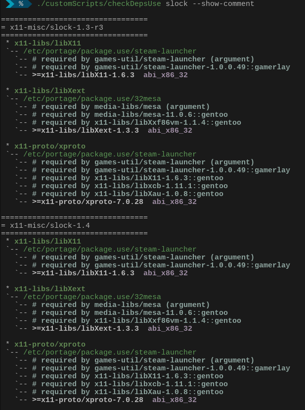
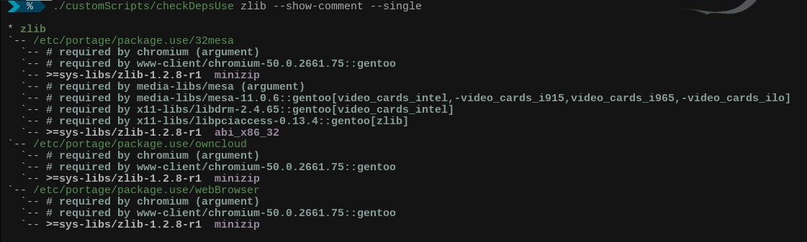

##说明

这里面将会是一些简单的脚本

### checkDepsUse.sh
```
Usage: ./checkDepsUse.sh packageName [--single] [--show-comment]

这个脚本需要先安装好 equery ，其他命令都应该是自带有的
可以查看到提供包所依赖的关系包下自定义了哪些非全局 use ，在哪个文件里面（默认都是在 /etc/portage/package.use/ 下的分立文件内查找）

 --single         不去计算依赖关系，直接查询提供包名已经设定了哪些非全局 use
 --show-comment   这个依赖于 /etc/portage/package.use/ 目录内分立文件中对应 use 设置上部是否有注释，有的话显示出来。

```
如图：




可以发现，重复的真多.. 我也懒得整理
